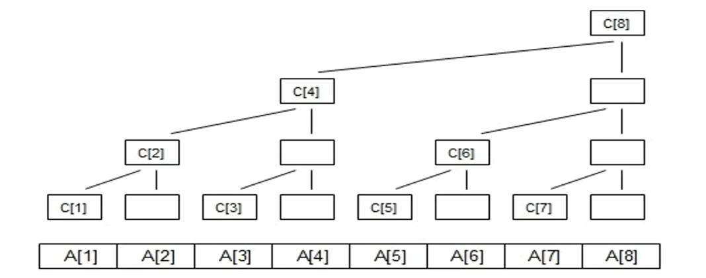

## 树状dp
### 前缀和
**定义**：第n项的值为前n-1项的和。
### 树状数组

**C[1]=A[1];  
C[2]=A[1]+A[2];  
C[3]=A[3];  
C[4]=A[1]+A[2]+A[3]+A[4];  
C[5]=A[5];  
C[6]=A[5]+A[6];  
C[7]=A[7];  
C[8]=A[1]+A[2]+A[3]+A[4]+A[5]+A[6]+A[7]+A[8];**  

构建树状数组
----

```c++
//求出最后一位1代表的整数
int lowbit(x)
//{ return x - (x& (x - 1));}
{ return x & -x ; }

```
```c++
//求前缀和
int sum (int i)
{
    int ret=O;while(i>0)
    {
        ret+=c[i];
        i-=lowbit(i);
    }
return ret;
}
```